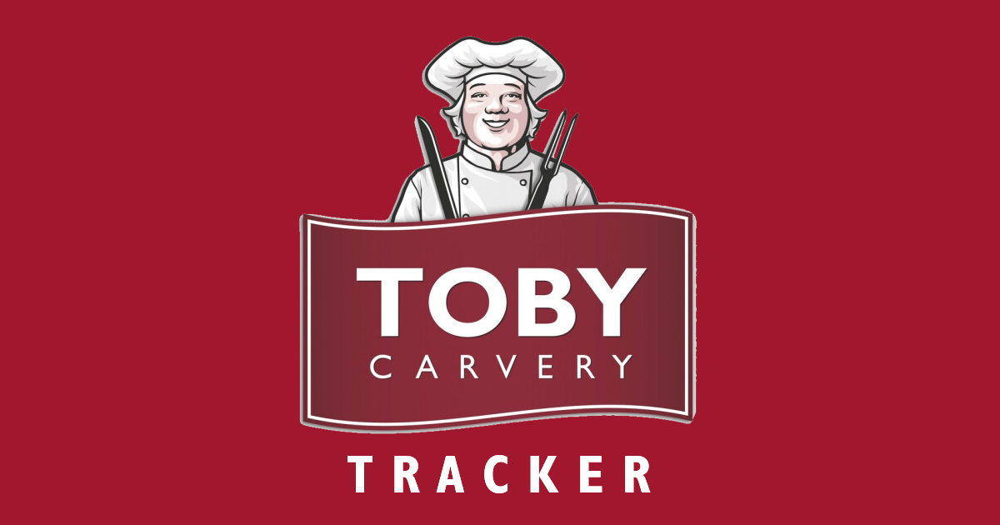

<div align="center">
    
</div>

# Tobery Tracker
Track all the toby carvery's we've been to.

## Technology Used
- Angular
- TypeScript
- Google Maps
- Sass
- Material UI
- Node
- Mongo
- mlab
- GCP

## Design

### Features
- Keep track of restaurants we've been to
- Keep record of star rating, photos, notes, data visited,
- Can tag restaurant as visitied and upload info
- Show a map of restaurants we haven't been to
- Put in route, shows you restaurant on the way
- Alerts when new restaurant added
- stats on visits

### Domain
```
Visit {
    time: datetime,
    review: text
    rating: integer (out of 5),
    photos: binary,
    location: geospatial
}
```

```
Restaurant {
    name: text,
    address: geospatial location
}
```

### Pages

#### Front Page
Picture, hamburger icon, stats

#### Add Visit Page
Choose restaurant and give review text, stars, add photos.

#### See All Visits Page
Show list with rating, click to see read only view (can edit?)

#### Find New Page
Show map, see circles, click circles, show how far we are from there.

#### Find en Route Page
put in start location and end location, put in threshold in miles, e.g. 5 miles. Shows places within threshold.

### Database

### Architecture

### ADRs

## Questions

## How to start the application locally
### Node Backend
```
cd backend
npm start
```

### Angular Frontend
```
cd frontend
npm start
```

## How to deploy the application

### Node Backend
```
cd backend
gcloud app deploy
Visit https://nodebackend-dot-tobery-tracker.appspot.com/restaurants
```

## Angular Frontend
```
cd frontend
gcloud app deploy
Visit 
```


